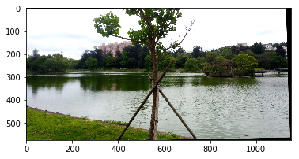
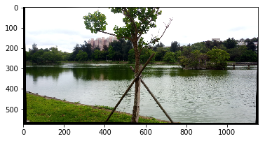
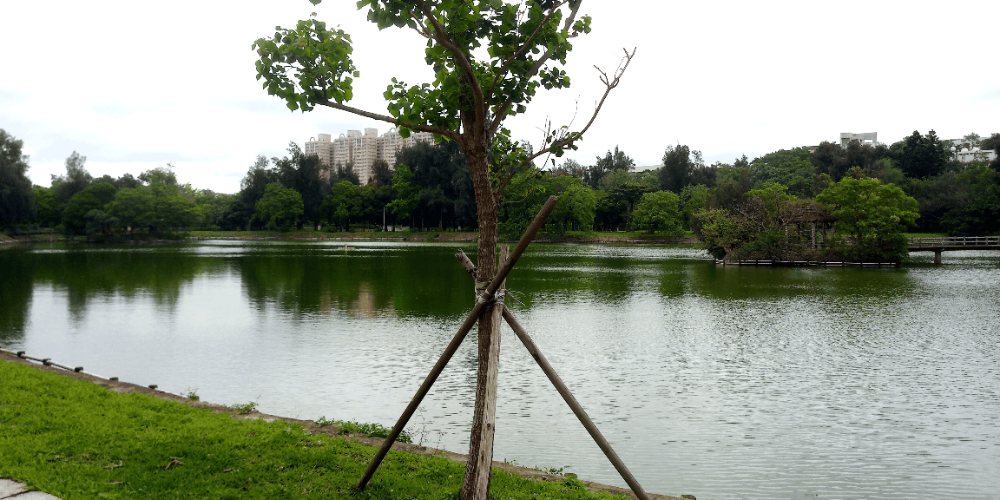
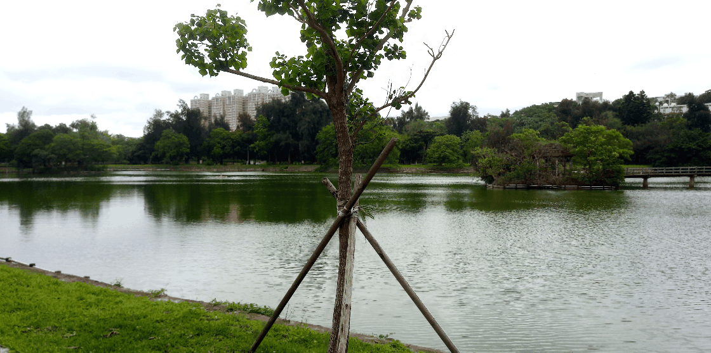

# CVFX-homework-5
Homework 4 for CVFX, team 7.

### Multi-view images

<a href="https://drive.google.com/drive/folders/1Ns592eUYIhbyfseaFfRYRmSlW_Uo05EV?fbclid=IwAR1FEz8MWkMxmXoM-tCCu_gO9kWhSP01aJhyzQfBFUuWyaO_lWAxKdm-UZs">樹的照片</a>

<a href="https://drive.google.com/drive/folders/1RxfTBw3E5GFz0Iow5faVP842jv0kky1_?fbclid=IwAR3cRYMfOYR8Gt5-IllIL-TxtcqrOda5LB8agz5TllkqA5Zrg6FWZ9UwBvE">碗的照片</a>

### Image alignment results

| SURF | SIFT|
|:---:|:---:|
| |  |

兩種方法看起來結果都差不多。

### Generate the multi-view 3D visual effects

我們做樹的Motion parallax。

| SURF | SIFT |
|:---:|:---:|
| |  |

兩種方法看起來結果都差不多。

### Use PS to enhance effect

用PhotoShop讓兩張圖的樹變成一模一樣，使得在合成出來的gif中，樹看起來不動進而在視覺上被強調出來。

做法：

針對第一張圖，先把樹挖掉，並用周圍景色把挖掉的部分填補上，之後把第二張圖的樹複製一份並貼到第一張圖上的同個位置，最後再和第二張圖合成gif檔即完成。

### Complete 3 different effects

#### Motion parallax

如上述。

#### Stop Motion

我們用上述圖片，沒有align的情況下直接做成gif。在拍照時，有用手機的格線有對水平線跟中心點的，所以直接製成gif時作為主角的樹理所當然的會位在旋轉軸上。

我們認為只要影像在拍攝的時候有讓主角位在影像中央、水平方向沒有變動、每張影像拍攝的位置和主角的距離一樣就可以直接製成gif，並且會有Stop motion的效果。

雖然沒有用到feature extraction得到好的Stop motion，但因課程提供的範例都是使用camera matrix來完成的，所以我們認為我們的做法是符合要求的。
課程範例：
1. The Matrix：從影片(<a href="https://upload.wikimedia.org/wikipedia/en/transcoded/3/31/The_Matrix_Bullet_Time_Effect.ogv/The_Matrix_Bullet_Time_Effect.ogv.240p.vp9.webm">影片連結</a>)可以看出該畫面是讓演員站在攝影機們的中央拍攝的，所以推測在後處理時並沒有用alignment。
2. 跳起來：圖片來自一個提供photo booth租用的網站(<a href="https://www.limelightphotobooth.com/matrix-cam-180-bullet-time-photo-booth/">網站連結</a>)，根據網站的描述和圖片，3, 5, 7, 12, 24, 或 48台相機排列成一個在同一平面上的半圓並且會同時捕捉影像，推測也是不需要用alignment就可以直接製成gif。
3. 婚攝：圖片來自一個婚攝的blog(<a href="https://www.jlbwedding.com/the-seven-camera-rig/">網站連結</a>)，內文描述到該影像是用7台攝影機排成一排拍攝的，這也可以解釋為何該gif轉的幅度沒有第二張跳起來那張多，因為不是排成一個半圓環繞主角，而是一條緊密的直線。

另外，我們有找到一篇2015年的paper：CamSwarm(<a href="https://arxiv.org/pdf/1507.01148.pdf">paper 連結</a>)，他們開發出了一款app可以透過wifi連接讓不同手機同時拍的照片可以合成有stop motion(內文使用bullet time)效果的gif。原理是透過手機得到拍照位置，然後用<a href="https://www.microsoft.com/en-us/research/wp-content/uploads/2016/07/Sinha-ICCV09.pdf">Piecewise Planar Stereo for Image-based Rendering</a>這個方法得到視角的內差。

因此我們認為，照片的品質對stop motion的效果影響非常大，若影像並沒有符合「主角位在影像中央、水平方向沒有變動、每張影像拍攝的位置和主角的距離一樣」的要求，單依靠feature extraction和alignment這兩個做法有幫助的地方只在於水平校正，對stop motion的結果幫助很有限。

#### Live Photo

##### Use PS to enhance effect

做法：

選一張圖片(以下簡稱A)當作固定不動的背景後，將其他四張圖的碗剪下並分別貼到A圖上，形成新的四張圖片，由於碗的大小有些微差異因此有手動微調，最後再合成gif檔即完成。
